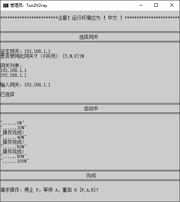

# UTCNetGo-Win

[中文说明](README_zh_CN.md)：解除UTC网络限制。 

[English Description](README.md): Break through the firewall of UTC. 

## 中文说明

现在仅能在**Windows**下运行，我正在想办法改进。

### 安装与使用
1. 在 [这里](https://github.com/thanksshu/UTCNetGo-Win/releases) 下载需要的版本
2. 下载Windows所需的[TAP-Windows](http://build.openvpn.net/downloads/releases/tap-windows-9.21.2.exe)并安装。
2. 解压缩后配置config.ini，主要是 **网关**
    * 打开config.ini (用记事本就可以了)
    * 更换 “=” 之后、“;” 之前的内容为目标值。
        * “;” 后的内容为注释
        * 配置网关时，可以通过此脚本获取
2. 点击“开始 start.bat”启动
3. 允许获取管理员权限
4. 选择是否使用设定网关，是则输入Y；如果此网关不是正在使用的网关，选择N；
    * 若选择N：找出正在使用的网关，填入config.ini。
5. 启动完成后请手动测试是否运作正常，如有问题输入R重启，并仔细检查网关设置。
    * 如果还有问题，请去[提出问题](https://github.com/thanksshu/UTCNetGo-Win/issues)
6. 输入S关闭。

### 文档:
[开源许可证](LICENSE)

[贡献代码](CONTRIBUTING.md)

[提出问题](https://github.com/thanksshu/UTCNetGo-Win/issues)

### 改进方向
* 完全替换掉Batch和VBscript
* 增加平台支持
* 自动更新核心组件
* 杂项

### 使用的项目
* [v2ray/v2ray-core](https://github.com/v2ray/v2ray-core)
* [eycorsican/go-tun2socks](https://github.com/eycorsican/go-tun2socks)
