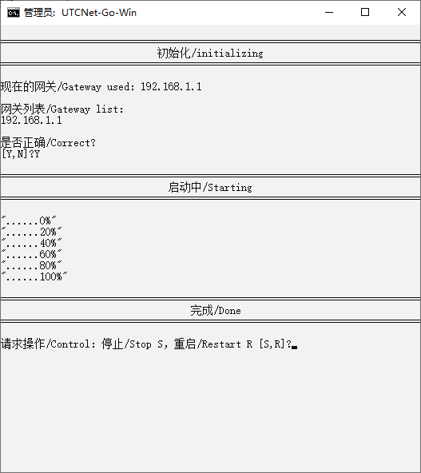

# UTCNetGo-Win

[中文说明](README_zh_CN.md)：用UTC的网络玩游戏。 

[English Description](README.md): Play video-games with UTC's net. 

## 中文说明

现在仅能在**中文版本**的Windows下运行，我会想办法改进的（咕咕咕）。

### 安装与使用
1. 在 [这里](https://gitlab.utc.fr/2018-2019utc/utcnetgo/releases) 下载需要的版本
2. 解压后点击“start.bat”启动
3. 允许获取管理员权限
4. 选择是否使用默认网关，是则输入Y；如果此网关不是正在使用的网关，选择N；退出选择F
    * 上一步选择N：输入列表中正在使用的网关，回车确认。
5. 启动完成后请手动测试是否运作正常，如有问题输入R重启，并仔细检查网关设置。如果还有问题，请去[提出问题](https://gitlab.utc.fr/2018-2019utc/utcnetgo/issues)
6. 输入F关闭。

### 文档:
[开源许可证](LICENSE)

[贡献代码](CONTRIBUTING.md)

[提出问题](https://gitlab.utc.fr/2018-2019utc/utcnetgo/issues)

### 下一步
* 完全替换掉批处理和VBscript
* 增加语言支持
* 增加平台支持
* 自动更新核心组件
* 杂项